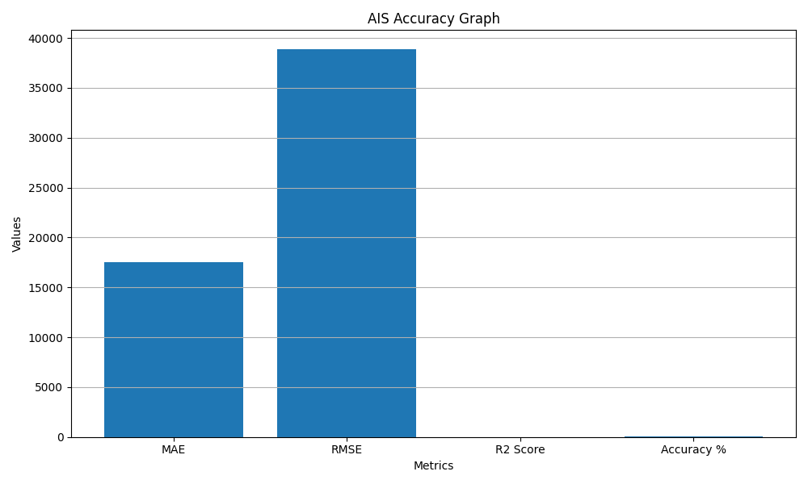

# 🌍 Export Demand Forecasting System

## 🧠 Forecasting Export Demand using Machine Learning & Bio-Inspired Optimization

---

## 👤 Author

**Sagnik Patra**

---

## 📌 Project Overview

This project builds an end-to-end **Export Demand Forecasting System** using Machine Learning and Bio-Inspired Optimization.

The system analyzes historical export data, transforms it into a structured format, applies feature engineering, and predicts future export demand using optimized machine learning models.

The project also generates result files, prediction reports, model files, configuration files, and visual graphs.

---


## 🎯 Objectives

- Analyze historical export demand data
- Convert raw export table data into ML-ready format
- Predict export demand using machine learning
- Optimize features using bio-inspired algorithms
- Generate result and prediction CSV files
- Save trained models and configurations
- Visualize performance using graphs and heatmaps

---

## ⚙️ Tech Stack

- Python
- Pandas
- NumPy
- Scikit-learn
- Matplotlib
- Joblib
- YAML
- JSON

---

## 🧬 Optimization Algorithms Used

- AIS - Artificial Immune System
- CSA - Crow Search Algorithm
- PSO - Particle Swarm Optimization
- QPSO - Quantum Particle Swarm Optimization
- BA - Bat Algorithm
- WOA - Whale Optimization Algorithm
- GWOA - Grey Wolf Optimization Algorithm
- ALOA - Ant Lion Optimization Algorithm

---

## 📂 Dataset

```text
Table_B-4.csv

Dataset path:

C:\Users\NXTWAVE\Downloads\Export Demand Forecasting System\Table_B-4.csv
🧪 Methodology
1. Data Loading

The dataset is loaded using Pandas from the local system path.

2. Data Transformation

The original wide-format export dataset is converted into long format using:

Market
Parameter
Year
Q/V Value
Percentage
3. Feature Engineering

New features are generated:

Lag 1
Lag 2
Rolling Mean 3
Encoded Market
Encoded Parameter
Year
Percentage
4. Feature Selection

Bio-inspired optimization algorithms are used to select the most important features.

5. Model Training

A Random Forest Regressor is trained using the selected features.

6. Evaluation

The model is evaluated using:

MAE
RMSE
R² Score
Accuracy Percentage
📊 Output Files
CSV Files
ais_export_demand_result.csv
ais_export_demand_prediction.csv
Model Files
ais_export_demand_model.pkl
ais_export_demand_scaler.pkl
ais_market_encoder.pkl
ais_parameter_encoder.pkl
Configuration Files
ais_export_demand_metrics.json
ais_export_demand_config.yaml
Graph Files
ais_result_graph.png
ais_prediction_graph.png
ais_comparison_graph.png
ais_heatmap.png
ais_accuracy_graph.png
ais_fitness_graph.png
ais_feature_importance_graph.png
📈 Accuracy Graph


📊 Result Graph

🔮 Prediction Graph

⚖️ Comparison Graph

🔥 Heatmap

🧬 Fitness Graph

⭐ Feature Importance Graph

📌 Model Performance Metrics

The model performance is stored in:

ais_export_demand_metrics.json

Example metrics:

{
  "Algorithm": "Artificial Immune System Feature Selection + Random Forest",
  "Selected_Features": [],
  "Best_AIS_Fitness": 0.0,
  "MAE": 0.0,
  "RMSE": 0.0,
  "R2_Score": 0.0,
  "Accuracy_Percentage": 0.0
}
🚀 How to Run

Install required libraries:

pip install pandas numpy scikit-learn matplotlib pyyaml joblib

Run the Python file:

python ais_export_demand_forecasting.py
📁 Project Folder Structure
Export Demand Forecasting System/
│
├── Table_B-4.csv
├── ais_export_demand_forecasting.py
│
├── ais_export_demand_result.csv
├── ais_export_demand_prediction.csv
│
├── ais_export_demand_model.pkl
├── ais_export_demand_scaler.pkl
├── ais_market_encoder.pkl
├── ais_parameter_encoder.pkl
│
├── ais_export_demand_metrics.json
├── ais_export_demand_config.yaml
│
├── ais_result_graph.png
├── ais_prediction_graph.png
├── ais_comparison_graph.png
├── ais_heatmap.png
├── ais_accuracy_graph.png
├── ais_fitness_graph.png
├── ais_feature_importance_graph.png
✅ Key Features
End-to-end export demand forecasting pipeline
Automated data cleaning and transformation
Feature selection using AIS
Random Forest based prediction model
CSV result generation
JSON and YAML configuration saving
Multiple visualization outputs
GitHub-ready project structure
🏆 Project Title

Export Demand Forecasting System using Artificial Immune System and Machine Learning

📌 Conclusion

This project demonstrates how machine learning and bio-inspired optimization can be used to analyze and forecast export demand. By combining feature engineering, AIS-based feature selection, and Random Forest regression, the system provides a structured and intelligent approach for trade data forecasting.
